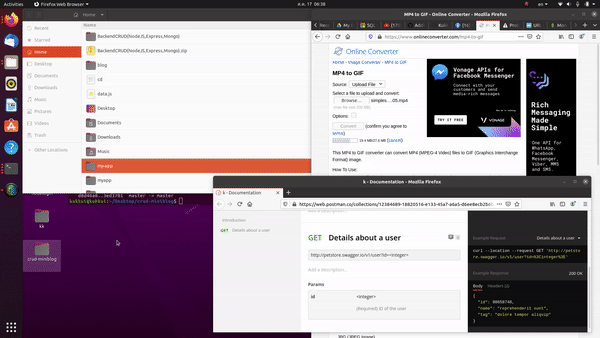
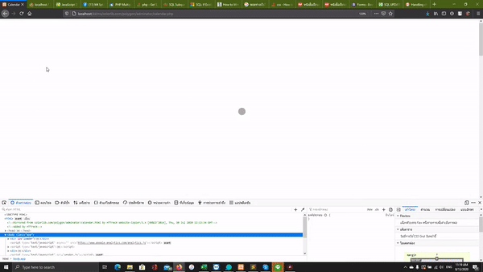

Sertis Backend&Frontend Exam
miniblog-crud-post/courses/quizz content

 
<b><u>#Instructions</u></b> 
This 2 projects are made within 24 hours(1 day Project). So, I really want to say sorry if there are any kinds of <em><b><u>non-clean code format</u></b>, <b><u>missing some inline comments</u></b> and <b><u>uncomfortable deployment.</u></b></em>
  

 
<b>@TASK 1:Backend </b>  
<b>Core Functions :</b>  /GET,/POST,/PUT,/DESTROY in backend side.  
<b>Mainly Built with :</b>  [NodeJS, Mongodb, ExpressJS, JSON]
 
 

 
<b>@TASK 2:Frontend </b>  
<b>Core Functions :</b>  CRUD, Authentication system, User permission control, LMS Platform, Author's content ADD,EDIT,UPDATE,DELETE  
<b>Mainly Built with :</b>  [PHP, Bootstrap 4, HTML, CSS, MySql, Restful API, CKEditor]
 
 
<b><u>#SetUp and Deployment</u></b>
  
<b> @ Task1:Backend </b>  
-1)Download the project or clone my repo. 
-2)Open terminal inside the root folder of Task1 <b>OR</b> cd crud-miniblog/Node.js-MySQL-CRUD-Operations. 
-3)npm install.
  
<b> @ Task2:Frontend </b>  
-1)Run XAMPP or any other tools for localhost/phpmyadmin.  
-2)Import DB-Table file called 'kklms.sql'. 
-3)Check whether the root folder already named as 'kklms'. 
-4)Edit the 'dbconnect.php' file for set the database credentials follow by your database system environments(such as: username,password,port). 
-5)Move this folder into the right path directory to start a deployment(such as: set the 'kklms' folder to be at ':C/xampp/htdocs/kklms'. 
-6)Done! Visit the url and navigate to : 'http://localhost/kklms/'
  

