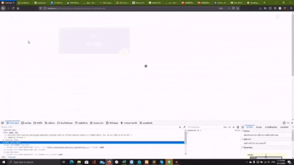

Note 

 
<b>BACKEND#1:</b>  
<b>Core Functions :</b> For non mongodb version is for Quick Deployment!  
<b>Mainly Built with :</b>  [RestfulAPI, NodeJS, ExpressJS, JSON, CRUD]
 
 

 
<b>BACKEND#2:</b>  
<b>Core Functions :</b>  For MongoDB version is for General Deployment!  
<b>Mainly Built with :</b>  [RestfulAPI, NodeJS, Mongodb, ExpressJS, JSON, CRUD]
 
 
<b><u>#SetUp and Deployment</u></b>
  
<b>BACKEND#1 </b>  
-1)Start terminal at root folder(backend-Json) 
-2)Type in "node index.js" 
-3)Navigate url: "http://localhost:3000/"
  

<b>BACKEND#2</b>  
-1)Run XAMPP or any other tools for localhost/phpmyadmin.  
-2)Import DB-Table file called 'kklms.sql'. 
-3)Check whether the root folder already named as 'kklms'. 
-4)Edit the 'dbconnect.php' file for set the database credentials follow by your database system environments(such as: username,password,port). 
-5)Move this folder into the right path directory to start a deployment(such as: set the 'kklms' folder to be at ':C/xampp/htdocs/kklms'. 
-6)Done! Visit the url and navigate to : 'http://localhost/kklms/'
  

